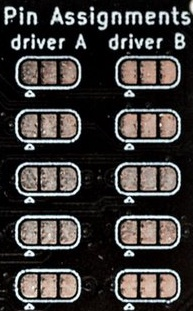
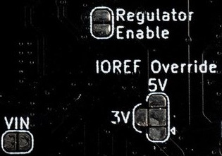
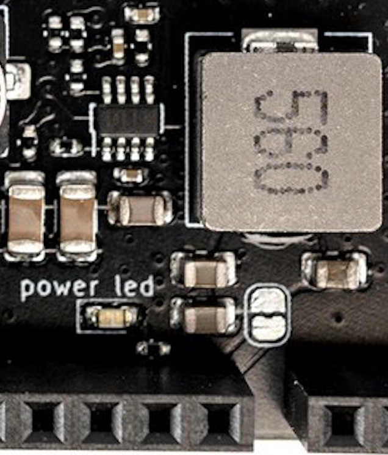

# EX-Motorshield8874

## Overview

The EX-Motorshield8874 is a pin compatible with the original [Arduino Motor Shield Rev3](https://store.arduino.cc/products/arduino-motor-shield-rev3) but provides significantly improved electrical performance for driving higher loads, with lower power dissipation, and improved usability.

The EX-Motorshield8874 is based on two DRV8874 H-bridge motor drivers with integrated current sensing from Texas Instruments (TI). It is used to drive inductive loads like relays, solenoids, DC and stepping motors.

Powering of Arduino motherboard is possible due to the onboard DC/DC buck converter, supporting a wide input supply range from 9 to 30V. The reverse polarity protection prevents damage to the circuit and its components in case the power supply is accidentally connected with reversed polarity.

This Shield features a green status LED which provides a visual indication of the power supply status.

### Compatibility with [Arduino Motor Shield Rev3](https://store.arduino.cc/products/arduino-motor-shield-rev3)

The EX-MotorShield8874 is pin compatible with the original Arduino Motor Shield but provides significantly improved electrical performance for driving higher loads. Input voltage range is 9-30VDC and the maximum peak output is 5A per channel, in contrast to 5-12VDC and 2A peak for the original Arduino Motor Shield.

There is also almost no voltage drop incurred from the input voltage due to the MOSFET based design, unlike the bipolar L298 used in the Arduino Motor Shield. For DCC and DC PWM model railway use, a range of 10-20VDC is recommended depending on scale.

## Control Pin Assignments

### Default Pin Assignment for DCC-EX/Arduino motor control

The EX-MotorShield8874 has the following default pin assignment for control pins on the Arduino header, and is used for full Arduino Motor Shield R3 compatibility when used for DCC-EX EX-CommandStation.

| Function | Channel A Pin | Channel B Pin |
|-----------|-------|-------|
| PWM       | D3  | D11 |
| Direction | D12 | D13 |
| Brake     | D9  | D8 |
| Current sensing | A0 | A1 |
| Fault_N   | A4  | A5 |

Default pin assignment is used for DCC-EX command stations, and has the DRV8874 mode select pin `PMODE` = high.

### Alternative Pin Assignment for DCC-EX/Arduino motor control 

All motor control signals can be connected to two different Adruino header pins. Selecting between the default pin out and the alternative pin out is done via solder jumpers on the PCB which must be first cut to disable the default position, then solder applied to select the alternate position.

| Function | Channel A Pin | Channel B Pin |
|-----------|-------|-------|
| PWM       | D2  | D5 |
| Direction | D10 | D4 |
| Brake     | D7  | D6 |
| Current sensing | A2 | A3 |
| Fault_N   | D0  | D1 |

NB: For DCC-EX control, these are not ideal pin assignments and are intended for future support of stacking of two shields. Further documentation updates will be available once testing of this mode is complete.

### Fault indicator

The H-Bridges are protected against supply undervoltage, charge pump undervoltage, output overcurrent and device overtemperature. Fault conditions are indicated on the pin `nFAULT` of the H-Bridge driver. The open drain output of the fault indicator is pulled low during a fault condition and pulled to high with the on board pull-up resistor. There is one fault indicator per channel.

**NOTE for UNO users:** the `nFAULT` pins are routed to the same pins used for I2C on the ATMEGA329P used on the Arduino UNO R3, namely A4 and A5. As such, if you are to use an EX-MotorShield8874 on an Arduino UNO, please cut the default track on the relevant jumpers to disable them. If you want to use the `nFault` pins you will need to manually jumper them to any available alternate digital input pins, then configure the Motor Driver entry in EX-CommandStation to suit the pins used.

### Alternative pin assignment for other motor control applications

The alternative pin assignment for motor control (PH/EN mode) allows to control the motor in a speed and direction type interface. This mode is selected via Jumper J101 (DRV8874 mode select pin `PMODE` = low) and is NOT required for use with DCC-EX. It is documented for completeness.

| Function | Channel A Pin | Channel B Pin |
|-----------|-------|-------|
| PH       | D3  | D11 |
| EN       | D12 | D13 |
| Brake     | D9  | D8 |
| Current sensing | A0 | A1 |
| Fault_N   | A4  | A5 |

## Electrical Parameters

The DCC-EX Motor Shield provides the following electrical parameters.

| Parameter | Value |
|-----------|-------|
| Operating voltage range | 9-30VDC, polarity protected|
| Maximum H-bridge current  | 5A peak per channel |
| Arduino supply voltage output (VIN) | 7.2V@2A max |
| IO voltage              | 3.3 and 5V, using IOREF by default |
| I2C connectivity        | Dupont, 2.54mm dual row pin, and STEMMA QT/Qwiic Headers |
| Current sensing         | Yes, adjusts range to IOREF voltage |
| Control modes possible | PWM, by default, PH/EN via jumper |

## Current Sensing

Current sensing is independently available for each channel. The Arduino IOREF supply voltage is sensed automatically, and adjusts the gain factor for the current sensing to take advantage of the full ADC input voltage range for 5V or 3.3V microcontrollers. The sense factors are calculated as follows for DCC-EX motor driver definitions:

| IOREF Voltage: | 5V | 3V3 |
|----------------|----|-----|
| 10-bit ADC, 1024 count | 5.08 | 4.94 |
| 12-bit ADC, 4096 count | 1.27 | 1.24 |

These values have been incorporated into EX-CommandStation's Motor Driver definitions, so selecting `EX8874_SHIELD` as the `MOTOR_SHIELD_TYPE` in config.h will configure it correctly.

## Track LEDs

LEDs are provided for each channel, indicating the corresponding H-Bridge is supplying power to output connectors.

## Header Pin Assignments

The following pin assignments have been used for the various connectors.

### I2C Headers

Three I2C expansion headers (Dupont, dual-row 8-pin, and STEMMA QT/Qwiic) allow connecting either an OLED display or other additional I2C based devices.

#### Arduino Header

On the Arduino header, the default upper right I2C pins are used for I2C:

| Function | UNO R3 Pin | Mega Pin |
|-----------|-------|-------|
| SCL | D18/A5 | D21 |
| SDA | D19/A4 | D20 |

#### DIP Header

The dual-row 8-pin header has the following pin assignments:

| Function | Odd Pin | Even Pin |
|-----------|-------|-------|
| IOREF | 1 | 2 |
| SDA | 3 | 4 |
| GND | 5 | 6 |
| SCL | 7 | 8 |

#### OLED Header

The single-row 4-pin OLED header has the following pin assignments, which are standard for many I2C capable OLED displays:

| Function | Pin |
|-----------|-------|
| GND | 1 |
| IOREF | 2 |
| SCL | 3 |
| SDA | 4 |

#### STEMMA QT/Qwiic Connector

STEMMA QT/Qwiic connector pin assignments are per the standard, but included for completeness:

| Function | Pin | Colour Code |
|-----------|-------|-------|
| GND | 1 | Black |
| IOREF | 2 | Red |
| SDA | 3 | Blue |
| SCL | 4 | Yellow |

Pull-up resistors for the I2C communication are not populated by default. If required, pull-up resistors (R101, R102) can be populated on the board, though this is typically not necessary.

## Reset button

A reset button is provided to reset the Arduino board.

## PCB Jumpers

Various PCB jumpers are provided to alter functionality of the board to suit user needs. These include jumpers to alter pin assignments for driving the motor shield, to disable the onboard 7.2V regulator or disconnect it from the VIN, and jumpers to override the IOREF pin for ADC range selection.

### Aternate Pin Assignment PCB Jumpers

There are 5 sets of PCB jumpers for each motor driver IC, some or all of which can be used to reassign Arduino pins to the various logic functions. The table below lists them in order as they appear on the PCB:

| Function | Driver A Default | Driver A Alternate| Driver B Default | Driver B Alternate |
|----------|---------|----------|---------|-----------|
| PWM       | D3  | D2 | D11 | D5 |
| Fault | A4  | D0 | A5 | D1 |
| Brake | D9  | D7 | D8 | D6 |
| Direction | D12 | D10 | D13 | D4 |
| Current sense | A0 | A2 | A1 | A3 |

### Power Configuration PCB Jumpers

There are 4 sets of PCB jumpers to change the way power is handled on the board. One on the top of the board, and 3 on the bottom, shown here:

 

| Jumper | Function |
|--------|----------|
| Regulator Enable | Defaults to ENABLED, cut between pads to DISABLE |
| IOREF Override | Defaults to IOREF, cut then solder to either 5V or 3V to power logic and current sense |
| VIN | Defaults to NOT connected. CAUTION: soldering these pads CONNECTS motor power to VIN and should not be needed |
| Regulator to VIN (unlabelled) | Defaults to ON, providing 7.2V power from regulator to VIN and down to the Arduino |

## Stacking Multiple Shields

It is possibile to stack two EX-MotorShield8874s, though for use in in DCC-EX EX-CommandStation this is not fully tested or yet supported by software configuration.

There are two different proposed operating modes possible:

1. **Independent district mode:** The DCC-EX Motor Shields are controlled independently using different control signals. This allows a total 4 independent H-Bridges to be driven completely independently for separate DCC or DC PWM districts.
2. **Parallel booster mode:** Both EX-MotorShield8874s are controlled with the same control signals so both pairs of H-bridges are running in parallel. This mode is used to increase the current capabilities of the 2 DCC or DC PWM districts.

This information is provided for reference. Documentation will be updated when both of these modes are fully tested and configured in DCC-EX EX-CommandStation.

***CAUTIONARY NOTE:*** Only one EX-MotorShield8874 should provide power to the underlying motherboard from the DCC power feed! The jumper connecting the VIN feed pin from the onboard 7.2V regulator to the Arduino sheild connectors must be cut on one of the stacked shields. It is also advisable to cut the ENABLE pin for the onboard regulator as that will turn it off completely as well.

## Reference

- [Schematic](https://github.com/semify-eda/motor-shield/blob/main/motor-shield.pdf)
- [DRV8874 Datasheet](https://www.ti.com/product/DRV8874?keyMatch=DRV8874&tisearch=search-everything&usecase=GPN)

 
